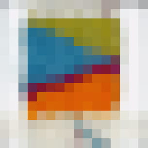

# Unravelling :iphone: :yarn:

Explore the relationship between textile technologies and WebAR

## About

_Unravelling_ explores the relationship between textile technologies, as a tactile means of making and marking time in isolation, and web-based technologies, as means of communicating and experiencing intimacy without touch.

_Unravelling_ took part during the [_Out of Touch: A Festival of Intimacy_](https://www.ucl.ac.uk/culture/whats-on/festival-intimacy) (Sat 19 June 2021), a day-long festival of intimate performances, conversations and interactions that responded to the themes of touch and intimacy, and asked what intimacy has meant whilst living through the Covid19 pandemic.

The events of the festival took place across UCL’s Bloomsbury Theatre, Grant Museum, Petrie Museum and a variety of outdoor spaces in between.

# Augmented textile

Three steps are required to setup the AR experience:

- take the photo of the woven square
- transform the photo into a AR marker
- link the pattern, the AR marker, to the media content to display

## Take the photo

Most critical part, and based on a trial and error approach, was how to photograph the tapestries. A good starting point is to follow the good practices suggested [here](https://medium.com/chialab-open-source/10-tips-to-enhance-your-ar-js-app-8b44c6faffca), however, using a physical object as a marker created some challenges, for example, the shadows cast by the object altering the photographed image. 

- A ring light to reduce the shadows
- the light needs to be cold-white and not be too bright, in order to reproduce the original colours of the woven marker as faithfully as possible
- the camera has to be placed perpendicular to the object
- the image is converted in a 16 by 16 pixels matrix, high resolution cameras do not provide any practical advantage.
- the size of the image need to be as close as possible to the final marker, in our case we used a cut-out with the black frame to help crop the image to the right size.

This is the setup we used during the event

.

The webcam was directed through the ring light to the woven object, which was in turn placed inside a black, printed frame. AR.Js enables a smartphone camera to recognise an image with a frame as a marker (generally a thicker frame helps in the recognition). In this project we used a cut-out of 9 by 9 cm with a border of 1.7cm thick, leaving an area available for the woven object of 5.8 by 5.8 (PatternRatio to set in the _index.html_ is 0.64). The captured images (we used the default Windows Camera App) were precisely cropped within the black frame, maintaining a square ratio.

The images to use should look similar to these ones:


The woven object view from the webcam


The image used as marker

## Create the AR Markers

The folder _./markergen_ contains the scripts to create the pattern _.patt_ used by _AR.Js_. It is based on the [AR.js marker-training](https://github.com/AR-js-org/AR.js/tree/master/three.js/examples/marker-training). After installing the _node_modules_, using `npm install`, these are the steps to follow:

- copy the images to convert into Pattern file in the _./markergen/img_ folder (images need to be square, PNG -with no alpha channel / transparency- or JPG);
- in a new `node.js` terminal, run `node generator` in the _./markergen_ folder ;
- the patterns will be created and saved in the folder _./markergen/patt_



The image converted as 16 by 16 pixels matrix

## Setup the AR Experience

The content of the AR experience is controlled by the _index.json_, located in the folder `./resources/content`. The JSON file contains an array of Objects and it has the following structure:

``` json
{
    "info": {
      "version": "1.0",
      "title": "unravelling",
      "markers":6
    },
    "content": [
      {
        "markerName": "patt_marker_1",
        "contentName": "Text.glb",
        "type":"model",
        "titleContent": " The Content 1"
      },
      {
        [other marker]
      },
      {
        "markerName": "patt_marker_x",
        "contentName": "content_x.jpg",
        "type":"image",
        "titleContent": "The Content x"
      }
    ]
  }
```

The important part is the `content` array:

- _markerName_: filename of the pattern exported from the generator, without extension
- _contentName_: filename of the content __with__ extension, possible options are:
  - JPG for images
  - MP3 for sounds
  - GLB for 3D models
- _type_: type of content to visualise, it is used to create the right AFrame entity
  - image
  - model
  - sound
- _titleContent_: text created using an AFrame text entity. Leave empty if none

All the media files need to be stored in the folder _./resources/content_ together with the _index.json_. All the pattern files _.patt_ need to be stored in the folder _./resources/patt_

## Team

Fiona Mathison (freelance artist)

Louise Klarnett (dance artist)

Leah Lovett (UCL - CASA - Connected Environments)

Valerio Signorelli (UCL - CASA - Connected Environments)
